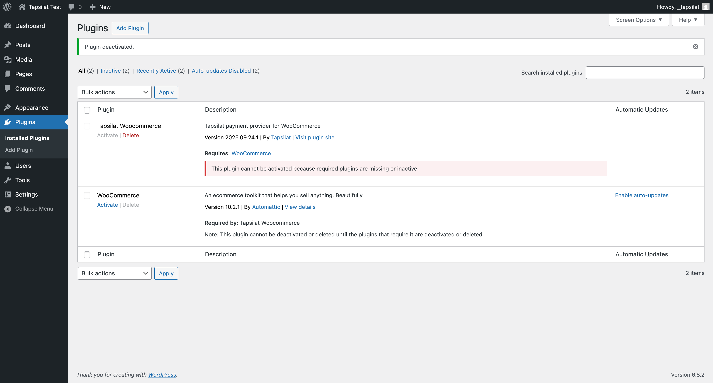
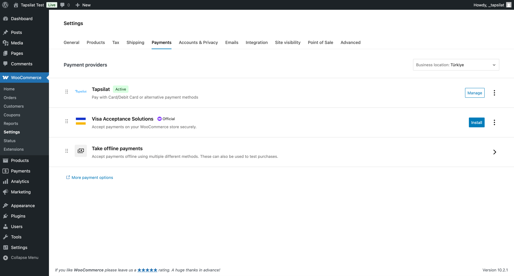
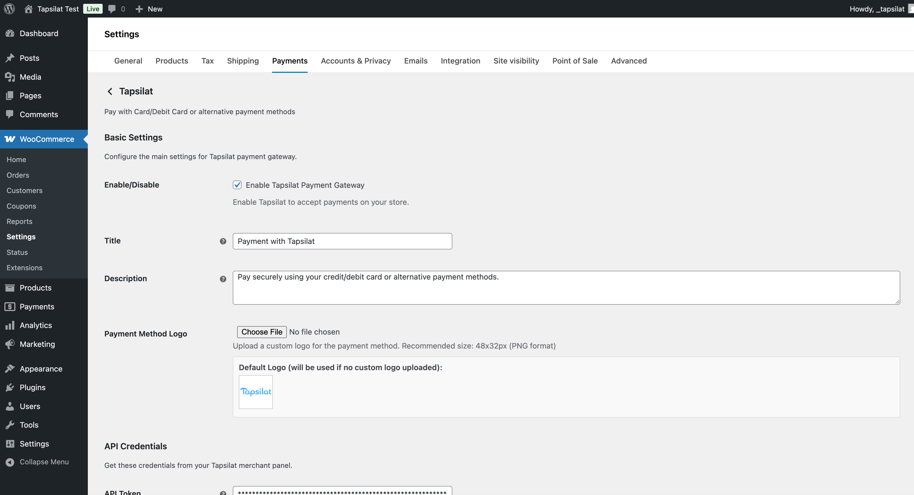
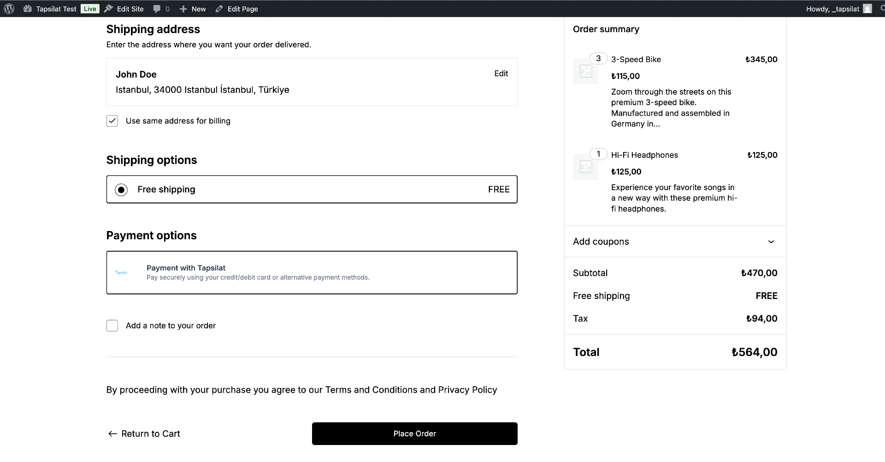
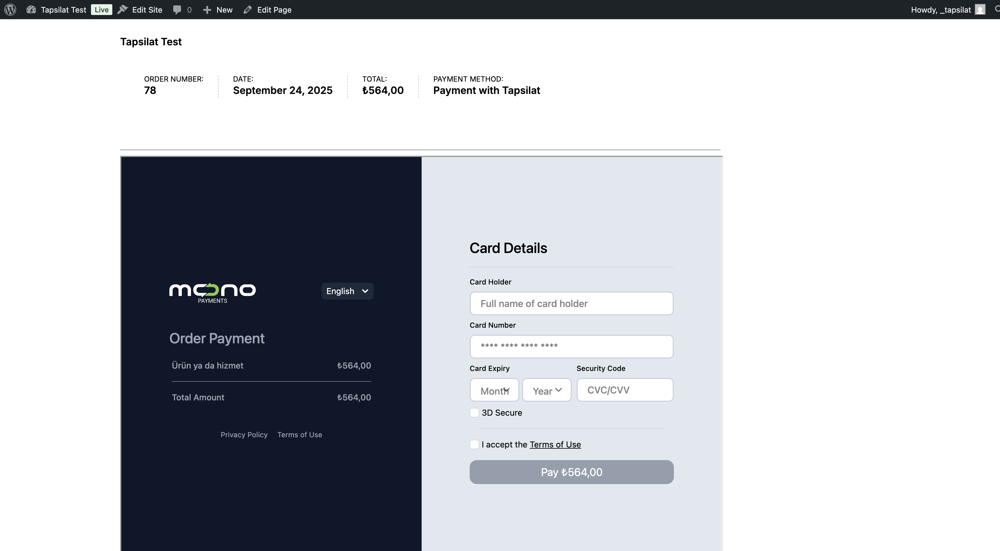

# Tapsilat WooCommerce Plugin

Modern payment gateway plugin for WooCommerce that integrates with Tapsilat payment system.

**Version:** 2025.09.24.1

## Features

- Secure payment processing via Tapsilat
- Support for WooCommerce Blocks (Gutenberg checkout)
- Multiple payment form display modes (iframe, redirect, popup)
- Automatic order status management with configurable cron job
- Webhook support for real-time payment updates
- Compatible with WooCommerce HPOS (High-Performance Order Storage)
- 3D Secure authentication support
- Multi-currency support (TRY, USD, EUR)
- Customizable payment form design and branding
- Advanced order status monitoring and automatic updates
- Custom logo support for payment method
- Flexible API environment configuration (Production/Custom)

## Installation

1. Upload the plugin files to `/wp-content/plugins/tapsilat-woocommerce` directory
2. Activate the plugin through the WordPress admin panel
3. Go to WooCommerce Settings > Payments > Tapsilat
4. Configure your Tapsilat API credentials
5. Enable the payment method

## Configuration

### Required Settings

- **Token**: Your Tapsilat API token
- **API Environment**: Choose between Production or Custom
- **Currency**: Select your preferred currency (TRY, USD, EUR)

### Advanced Configuration Options

- **3D Secure**: Enable/disable 3D Secure authentication for enhanced security
- **Payment Form Display**: Choose between iframe (embedded), redirect, or popup modes  
- **Order Status Check Frequency**: Configure automatic cron job interval (5, 10, 15, or 30 minutes)
- **Design Customization**: Customize colors for input fields, labels, buttons, and panels
- **Custom Logo**: Upload custom logos for both payment method and checkout page
- **Custom Metadata**: Add additional data to be sent with orders (JSON format)

### How to get API Key?

You can get API Key from [Tapsilat](https://panel.tapsilat.com) website.

### Webhook URLs

Configure these URLs in your Tapsilat merchant panel:

- Success URL: `https://yoursite.com/wp-json/tapsilat/v1/webhook/payment-success`
- Failure URL: `https://yoursite.com/wp-json/tapsilat/v1/webhook/payment-failure`
- Callback URL: `https://yoursite.com/wp-json/tapsilat/v1/webhook/payment-callback`

## Automatic Order Status Updates

The plugin includes an intelligent cron job system that automatically monitors and updates order statuses:

- **Configurable Intervals**: Set automatic checks every 5, 10, 15, or 30 minutes
- **Smart Processing**: Only checks orders that need status updates to optimize performance
- **Recent Order Skip**: Avoids checking recently modified orders to prevent conflicts

### Supported Status Mappings

| Tapsilat Status | WooCommerce Status | Action |
|----------------|-------------------|---------|
| SUCCESS/COMPLETED | Processing | Payment completed, order processed |
| FAILED/CANCELLED/EXPIRED | Failed | Order marked as failed |
| PENDING/WAITING | On Hold | Order waiting for payment |

## Requirements

- WordPress 5.0 or higher
- WooCommerce 8.0 or higher
- PHP 7.4 or higher
- Tapsilat merchant account

## Screenshots

1. **WordPress Plugin Management Page** -   
   View and manage the Tapsilat WooCommerce plugin from the WordPress admin panel.

2. **WooCommerce Payment Providers** -   
   Tapsilat payment gateway listed among WooCommerce payment methods.

3. **Tapsilat Settings Management Page** -   
   Comprehensive configuration options for API credentials, payment settings, and customization.

4. **Checkout Page with Tapsilat Payment Selection** -   
   Customer-facing checkout page showing Tapsilat as a payment option.

5. **Payment Processing Page** -   
   Secure payment form with card details and 3D Secure authentication.

## Plugin Management

### System Status Monitoring

The plugin provides comprehensive system status information in the admin settings:

- **Cron Job Status**: Monitor if automatic order checking is active
- **Next Scheduled Run**: See when the next status check will occur
- **Pending Orders Count**: Track how many orders are awaiting status updates
- **Configuration Health**: Verify all required settings are properly configured

## Changelog

### Version 2025.09.24.1

**New Features:**
- Advanced cron job system for automatic order status monitoring
- Configurable check intervals (5, 10, 15, 30 minutes)
- Comprehensive design customization options
- Custom logo support for payment methods
- 3D Secure authentication toggle
- Smart order status mapping and updates
- System status monitoring dashboard
- Performance optimizations for large order volumes

**Improvements:**
- Enhanced admin interface with dynamic field visibility
- Better error handling and logging
- Improved API environment configuration
- Token visibility toggle for security
- Webhook URL display for easy configuration

## Support

For technical support, please contact Tapsilat support team.
